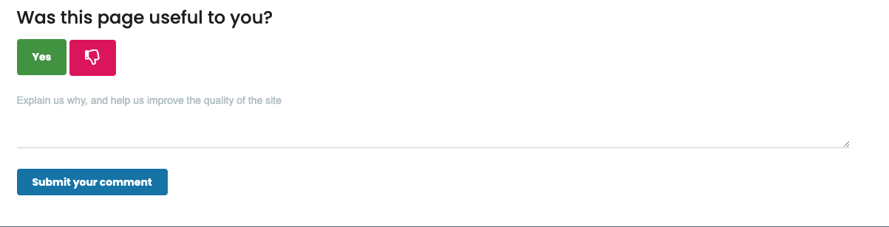
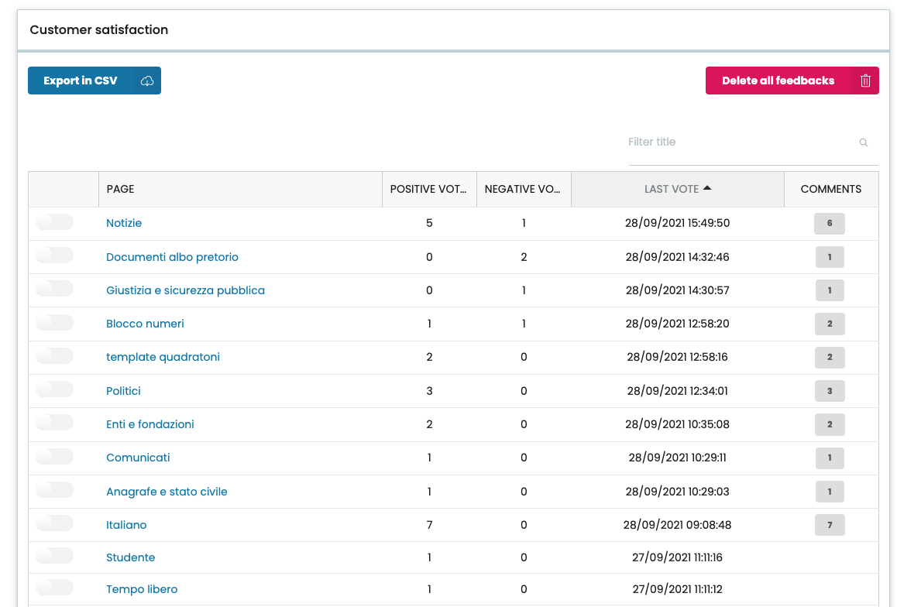
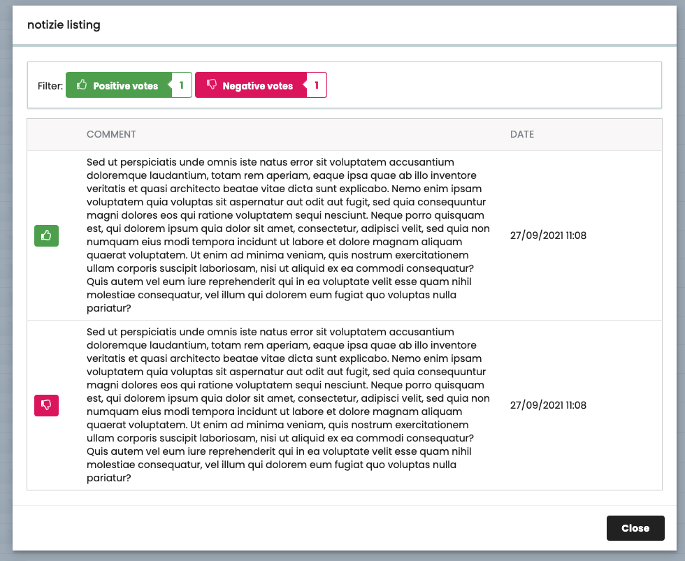

# volto-customer-satisfaction

Volto addon for customer satisfaction.

Install with mrs-developer (see [Volto docs](https://docs.voltocms.com/customizing/add-ons/)) or with:

```bash
yarn add volto-customer-satisfaction
```

Created with [voltocli](https://github.com/nzambello/voltocli).

## Usage

This addons exports CustomerSatisfaction component that could be added in your site pages to get feedback from users on the usefulness of the page.
It needs <https://github.com/RegioneER/rer.customersatisfaction> this Plone addon to work.

It also need a RAZZLE_RECAPTCHA_KEY in your .env to work or RAZZLE_HONEYPOT_FIELD env var..

From version 0.3.0 it needs rer.customersatisfaction >= 1.3.0 (added Honeypot integration).

If you are on Volto version 15 or lower, use version 0.x of this add-on.
Version 1.0.0 requires Volto >= 16.0.0-alpha.38.

```jsx
import {CustomerSatisfaction} from 'volto-customer-satisfaction';

...
<CustomerSatisfaction/>
...
```


When user click on 'Yes' or 'No' button a textarea is shown to leave a comment or suggestion:



## Panel

This addon also adds a button to the toolbar to access customer satisfaction panel:


Into the panel, you can view a summary of customer satisfaction feedbacks and leaved comments:



Comments are shown in a modal and are filterable:


## Honeypot integration

If you want to use Honeypot, you have to set env var RAZZLE_HONEYPOT_FIELD with the same value of the HONEYPOT_FIELD env var setted on plone backend.
